# SiteScore AI 🗺️

<div align="center">

**SaaS de Seleção de Local Comercial impulsionado por OSM + Machine Learning**

[](https://fastapi.tiangolo.com)
[](https://vuejs.org/)
[](https://www.python.org/)
[](https://opensource.org/licenses/MIT)

</div>

SiteScore AI traduz dados geoespaciais do **OpenStreetMap** (via Overpass API) em *insights acionáveis* para auxiliar na escolha estratégica de pontos comerciais. Utilizando análise geoespacial avançada e machine learning, o sistema avalia localizações baseado em concorrência, fluxo de pessoas, transporte público, e mix de amenidades.

---

## 📸 Screenshots

### Interface Principal

<div align="center">

<p><em>Interface inicial do SiteScore AI com mapa interativo</em></p>
</div>

### Jornada de Análise

<div align="center">

<p><em>Selecionando ponto para abertura do negócio no mapa</em></p>
</div>

<div align="center">

<p><em>Escolhendo o tipo de negócio para análise</em></p>
</div>

<div align="center">

<p><em>Definindo o raio de análise da localização</em></p>
</div>

### Busca e Geocoding

<div align="center">

<p><em>Buscando endereço via geocoding</em></p>
</div>

<div align="center">

<p><em>Visualizando lista de endereços encontrados</em></p>
</div>

### Visualização de Dados

<div align="center">

<p><em>Mapa mostrando concorrentes na região (Competition Layer)</em></p>
</div>

<div align="center">

<p><em>Visualização de pontos de interesse (POIs Layer)</em></p>
</div>

### Relatório de Análise

<div align="center">

<p><em>Relatório de análise - Score e métricas principais</em></p>
</div>

<div align="center">

<p><em>Relatório de análise - Detalhes e insights</em></p>
</div>

---

## 📋 Índice

- [Screenshots](#-screenshots)
- [Arquitetura](#-arquitetura)
- [Frontend - Componentes e Features](#-frontend---componentes-e-features)
- [Jornadas do Usuário](#-jornadas-do-usuário)
- [Stack Tecnológica](#-stack-tecnológica)
- [Fluxo de Scoring](#-fluxo-de-scoring)
- [Modelo de Features](#-modelo-de-features)
- [API Endpoints](#-api-endpoints)
  - [Core Endpoints (Score, Advanced, Demographics)](#core-endpoints)
  - [Geocoding e Layers](#get-apiv1geocode)
  - [Projetos e Health](#post-apiv1projects)
- [Pipeline de Machine Learning](#-pipeline-de-machine-learning)
- [Cache e Performance](#-cache-e-performance)
- [Segurança e Rate Limiting](#-segurança-e-rate-limiting)
- [Como Executar](#-como-executar)
- [Observabilidade](#-observabilidade)
- [Overpass API - Queries](#-overpass-api--queries-e-boas-práticas)
- [Testes](#-testes)
- [Integração GTFS](#-integração-gtfs-transporte-público)
- [Roadmap](#-roadmap-e-features-implementadas)

---

## 🏗️ Arquitetura

### Visão Geral do Sistema

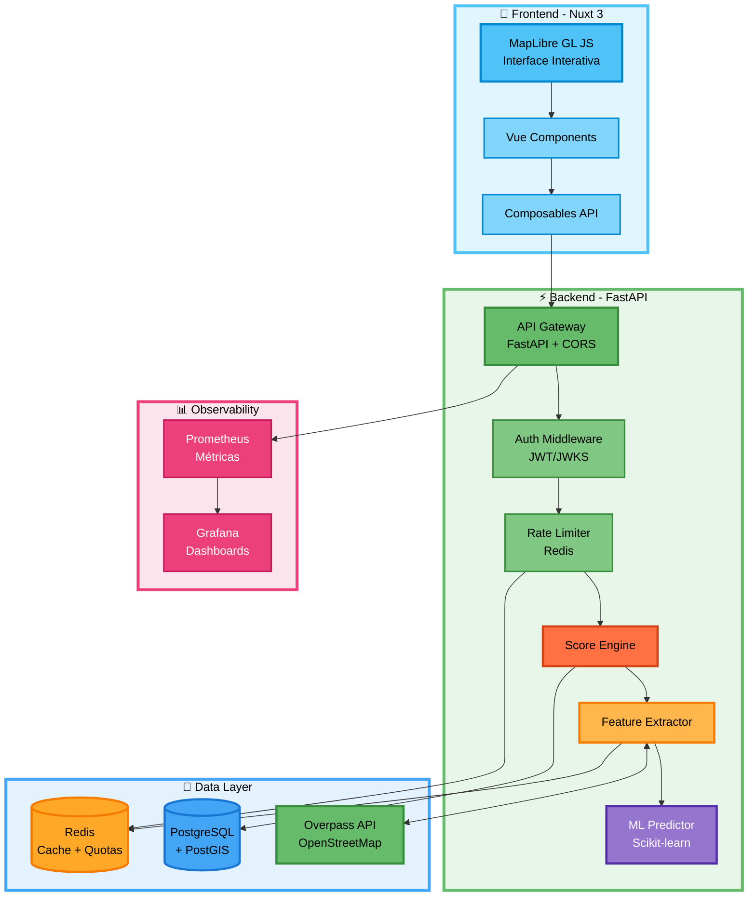

### Estrutura de Diretórios

```
sitescore-ai-saas-pro/
├─ backend-python/              # Backend em Python
│  ├─ app/
│  │  ├─ api/v1/endpoints/      # Endpoints REST
│  │  │  ├─ scoring.py          # POST /score - Motor de análise
│  │  │  ├─ layers.py           # GET /layers/* - Dados geoespaciais
│  │  │  ├─ projects.py         # CRUD de projetos salvos
│  │  │  ├─ geocode.py          # Geocoding via Nominatim
│  │  │  └─ health.py           # Healthcheck
│  │  ├─ core/                  # Lógica de negócio
│  │  │  ├─ config.py           # Configurações (Pydantic Settings)
│  │  │  ├─ db.py               # SQLAlchemy + GeoAlchemy2
│  │  │  ├─ cache.py            # Redis cache (TTL 7 dias)
│  │  │  ├─ overpass_client.py  # Cliente Overpass + retry
│  │  │  ├─ features.py         # Extração de features geoespaciais
│  │  │  ├─ scoring_model.py    # Modelo baseline explicável
│  │  │  ├─ auth.py             # JWT/JWKS validation
│  │  │  ├─ rate_limit.py       # Quotas por usuário/IP
│  │  │  ├─ audit.py            # Log de chamadas Overpass
│  │  │  ├─ metrics.py          # Prometheus instrumentação
│  │  │  ├─ centrality.py       # Street centrality (osmnx)
│  │  │  └─ gtfs.py             # Parser GTFS para transporte
│  │  ├─ models/                # Modelos SQLAlchemy
│  │  │  ├─ project.py          # Projetos salvos
│  │  │  ├─ cache_entry.py      # Cache persistente
│  │  │  └─ overpass_audit.py   # Auditoria API
│  │  ├─ ml/                    # Machine Learning
│  │  │  ├─ train.py            # Pipeline de treino (GBR)
│  │  │  └─ README.md           # Documentação ML
│  │  ├─ models_store/          # Modelos treinados (.joblib)
│  │  ├─ scripts/
│  │  │  └─ seed.py             # Seeds de dados
│  │  ├─ tests/                 # Testes Pytest
│  │  │  ├─ test_features.py
│  │  │  └─ test_scoring.py
│  │  ├─ schemas.py             # Pydantic schemas
│  │  └─ main.py                # Entry point FastAPI
│  ├─ requirements.txt          # Dependências Python
│  └─ Dockerfile                # Container backend
│
├─ frontend-vue/                # Frontend em Vue 3
│  ├─ components/
│  │  ├─ MapView.vue            # 🗺️ Componente principal do mapa
│  │  ├─ AdvancedAnalysisPanel.vue  # 📊 Painel de análise avançada
│  │  ├─ DemographicsPanel.vue  # 👥 Painel de perfil demográfico
│  │  ├─ GaugeChart.vue         # 📊 Gráfico semi-circular de score
│  │  ├─ RadarChart.vue         # 🕸️ Gráfico radar de features
│  │  ├─ ScoreBadge.vue         # 🏆 Badge visual de score
│  │  ├─ POIPopup.vue           # 📍 Popup de detalhes de POI
│  │  ├─ LoadingSpinner.vue     # ⏳ Indicador de carregamento
│  │  ├─ SkeletonCard.vue       # 💀 Loading placeholder
│  │  ├─ ToastContainer.vue     # 🍞 Notificações toast
│  │  └─ DarkModeToggle.vue     # 🌙 Toggle de modo escuro
│  ├─ composables/
│  │  ├─ useApi.ts              # 🌐 Client HTTP
│  │  ├─ useMapLayers.ts        # 🗺️ Gerenciamento de camadas
│  │  ├─ useDarkMode.ts         # 🌙 Controle de tema escuro
│  │  ├─ useExport.ts           # 📥 Exportação JSON/CSV
│  │  └─ useToast.ts            # 🍞 Sistema de notificações
│  ├─ pages/
│  │  ├─ index.vue              # 🏠 Página principal do mapa
│  │  ├─ dashboard.vue          # 📊 Dashboard de projetos
│  │  └─ compare.vue            # ⚖️ Comparador de locais
│  ├─ plugins/
│  │  └─ maplibre.client.ts     # Plugin MapLibre
│  ├─ assets/css/
│  │  └─ main.css               # Estilos globais
│  ├─ nuxt.config.ts            # Configuração Nuxt
│  ├─ tailwind.config.js        # Configuração Tailwind CSS
│  ├─ package.json
│  └─ Dockerfile                # Container frontend
│
├─ prometheus/
│  └─ prometheus.yml            # Config Prometheus
├─ docker-compose.yml           # Orquestração de serviços
├─ Makefile                     # Comandos de desenvolvimento
├─ .env.example                 # Variáveis de ambiente
└─ LICENSE                      # MIT License
```

---

## 🎨 Frontend - Componentes e Features

### Componentes Vue 3

#### Visualização de Dados
| Componente | Descrição | Tecnologia |
|-----------|-----------|------------|
| **GaugeChart.vue** | Gráfico semi-circular (gauge) para exibir score 0-100 | Chart.js + vue-chartjs |
| **RadarChart.vue** | Gráfico radar multi-dimensional para features | Chart.js RadialScale |
| **ScoreBadge.vue** | Badge visual colorido com classificação do score | Tailwind CSS |
| **AdvancedAnalysisPanel.vue** | Painel completo com 9 métricas de análise avançada | Vue 3 Composition API |
| **DemographicsPanel.vue** | Painel de perfil demográfico com insights de público | Vue 3 + Tailwind |

#### Mapa e Interação
| Componente | Descrição |
|-----------|-----------|
| **MapView.vue** | Componente principal do mapa interativo (MapLibre GL JS) |
| **POIPopup.vue** | Popup com detalhes de POIs ao clicar no mapa |

#### UI/UX
| Componente | Descrição |
|-----------|-----------|
| **LoadingSpinner.vue** | Indicador de carregamento animado |
| **SkeletonCard.vue** | Loading placeholder para melhor UX |
| **ToastContainer.vue** | Sistema de notificações não-intrusivas |
| **DarkModeToggle.vue** | Toggle entre modo claro/escuro |

### Composables (Lógica Reutilizável)

#### `useApi.ts`
Client HTTP para comunicação com backend.
```typescript
const api = useApi()
const result = await api.scoreLocation(lat, lon, businessType)
```

#### `useMapLayers.ts`
Gerenciamento de camadas do mapa (competition, POIs, transit, flow).

#### `useDarkMode.ts`
**Dark Mode com persistência**
```typescript
const { isDark, toggle, init } = useDarkMode()
// Detecta preferência do sistema
// Persiste em localStorage
// Aplica classe 'dark' no DOM
```

#### `useExport.ts`
**Exportação de dados**
```typescript
const { exportToJSON, exportToCSV, captureScreenshot } = useExport()

// Exportar análise
exportToJSON(scoreData, 'analise-site.json')
exportToCSV(projectsList, 'projetos.csv')
```

Funcionalidades:
- Exportação JSON com formatação
- Exportação CSV com escape de caracteres especiais
- Download automático via Blob API

#### `useToast.ts`
**Sistema de notificações**
```typescript
const { success, error, warning, info } = useToast()

success('Análise concluída!')
error('Erro ao carregar dados', 5000)
```

---

## 🧭 Jornadas do Usuário

### Jornada 1: Análise Rápida de Local

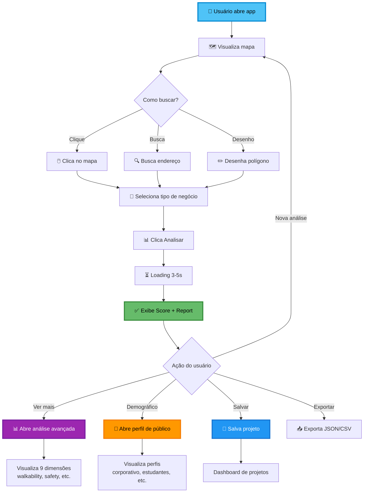

### Jornada 2: Comparação de Múltiplos Locais

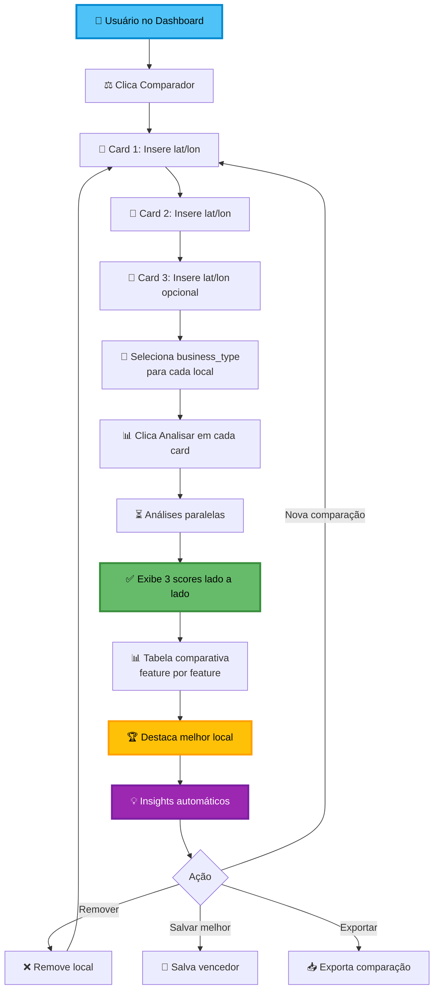

### Jornada 3: Dashboard de Projetos Salvos

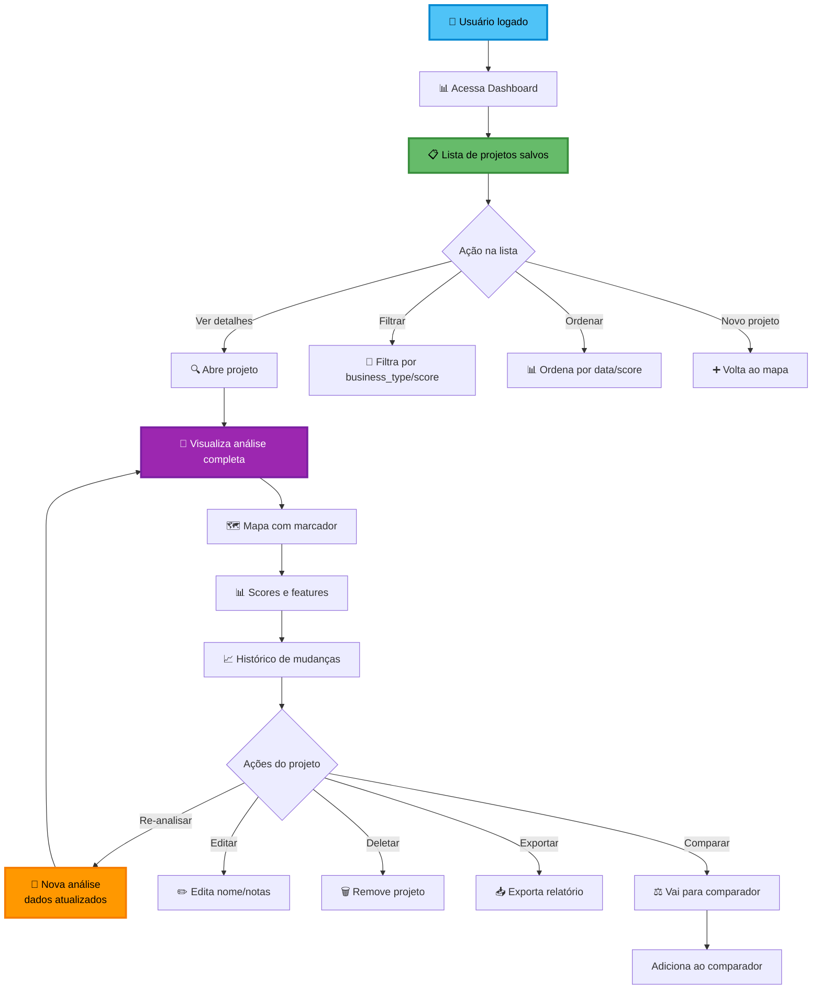

### Jornada 4: Análise Avançada + Demografia

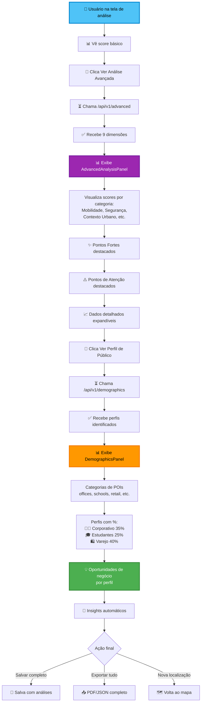

### Jornada 5: Visualização de Layers no Mapa

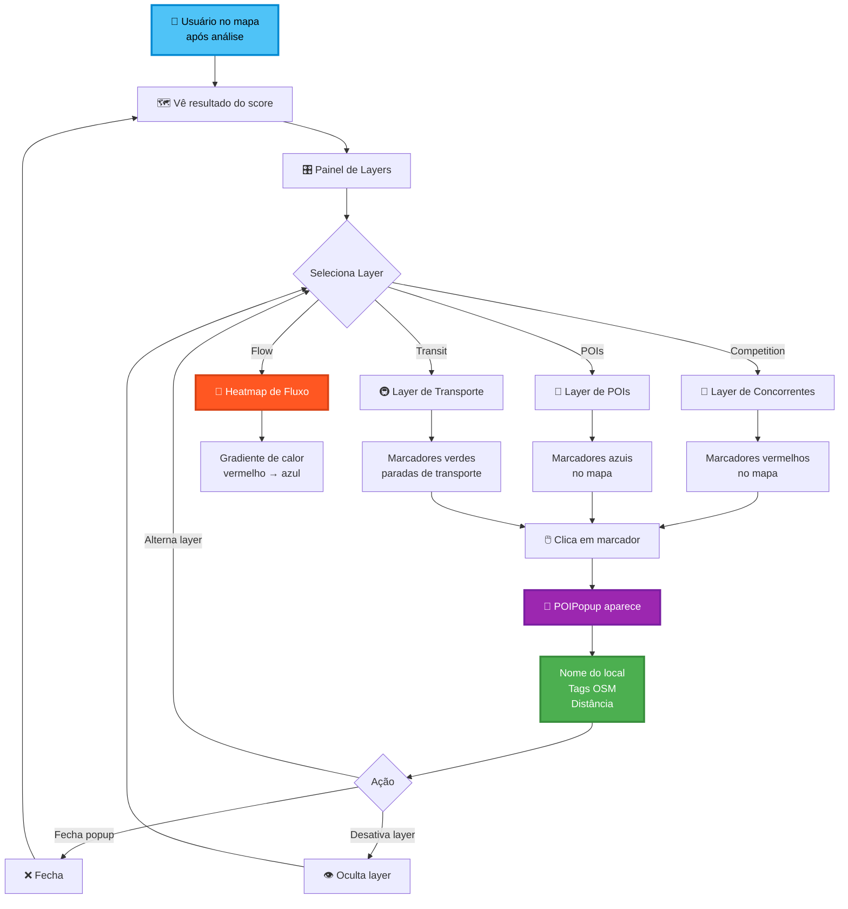

### Jornada 6: Dark Mode e Preferências

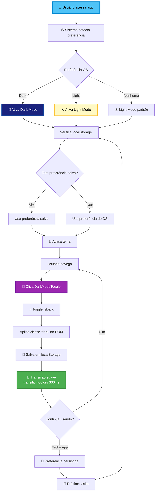

### Jornada 7: Sistema de Notificações (Toasts)

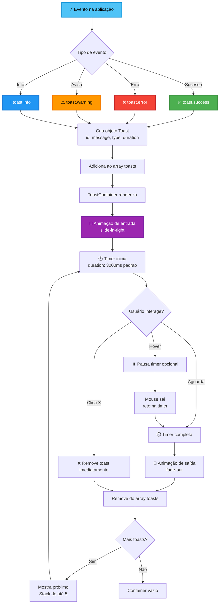

### Jornada 8: Exportação de Dados

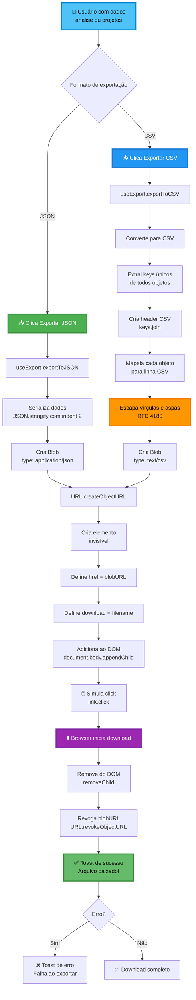

### Jornada 9: Geocoding (Busca de Endereço)

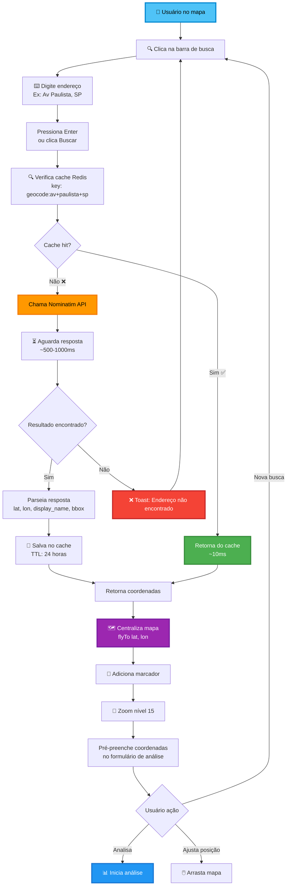

---

## 🔧 Stack Tecnológica

### Backend
| Tecnologia | Versão | Propósito |
|-----------|--------|-----------|
| **FastAPI** | 0.115.0 | Framework web assíncrono de alta performance |
| **SQLAlchemy** | 2.0.35 | ORM para persistência de dados |
| **GeoAlchemy2** | 0.15.2 | Extensão geoespacial para SQLAlchemy |
| **PostgreSQL + PostGIS** | 16-3.4 | Banco de dados com extensões geoespaciais |
| **Redis** | 7 | Cache em memória e rate limiting |
| **GeoPandas** | 1.0.1 | Análise de dados geoespaciais |
| **Shapely** | 2.0.4 | Manipulação de geometrias |
| **Scikit-learn** | 1.5.2 | Machine learning (Gradient Boosting) |
| **OSMnx** | 1.9.3 | Análise de redes de ruas |
| **Tenacity** | 8.2.3 | Retry com exponential backoff |
| **Prometheus** | - | Coleta de métricas |

### Frontend
| Tecnologia | Versão | Propósito |
|-----------|--------|-----------|
| **Nuxt 3** | 3.x | Framework Vue SSR/SSG |
| **Vue.js** | 3.x | Framework reativo |
| **MapLibre GL JS** | - | Renderização de mapas interativos |
| **TypeScript** | - | Type safety |

### Infraestrutura
- **Docker & Docker Compose**: Containerização e orquestração
- **Uvicorn**: ASGI server (2 workers)
- **Grafana**: Visualização de métricas

---

## 🎯 Fluxo de Scoring

### Diagrama de Sequência Completo

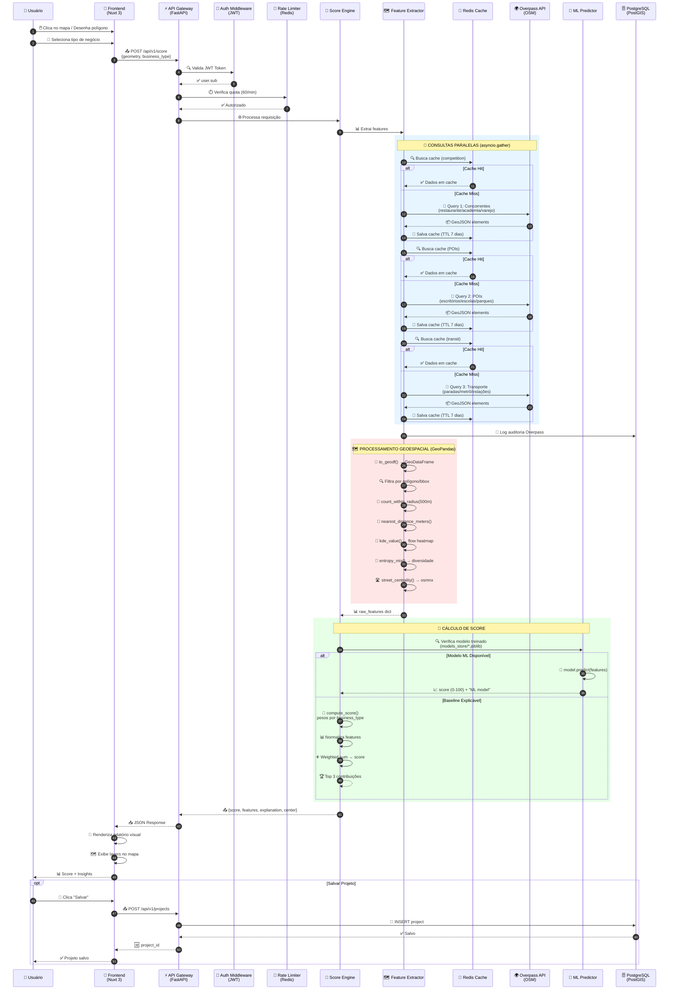

### Pipeline de Features (Detalhado)

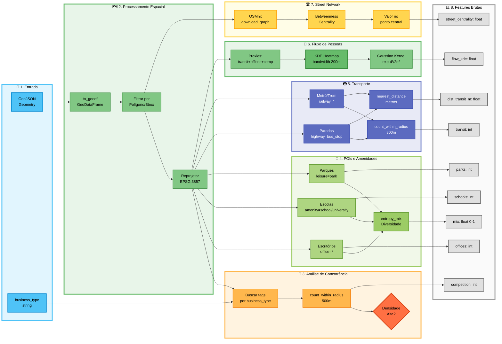

---

## 📊 Modelo de Features

### Features Extraídas (9 dimensões)

| Feature | Tipo | Descrição | Cap/Range | Método |
|---------|------|-----------|-----------|--------|
| `competition` | int | Número de concorrentes em 500m | 0-50+ | `count_within_radius(500)` |
| `offices` | int | Escritórios em 500m | 0-300+ | `filter_by_tag('office')` |
| `schools` | int | Escolas/universidades em 500m | 0-20+ | `filter_by_tag('amenity', ['school','university'])` |
| `parks` | int | Parques em 500m | 0-10+ | `filter_by_tag('leisure', ['park'])` |
| `transit` | int | Paradas de transporte em 300m | 0-40+ | Overpass `highway=bus_stop` + `railway=*` |
| `dist_transit_m` | float | Distância ao transporte mais próximo | 0-∞ m | `nearest_distance_meters()` |
| `flow_kde` | float | Densidade de fluxo estimado (KDE) | 0-50+ | Gaussian KDE (bandwidth 200m) |
| `mix` | float | Entropia de mix de amenidades | 0.0-1.0 | Shannon entropy normalizada |
| `street_centrality` | float | Betweenness centrality (osmnx) | 0.0-1.0 | Rede de ruas (opcional) |

### Modelo de Scoring Baseline (Explicável)

**Sistema de pesos por tipo de negócio:**

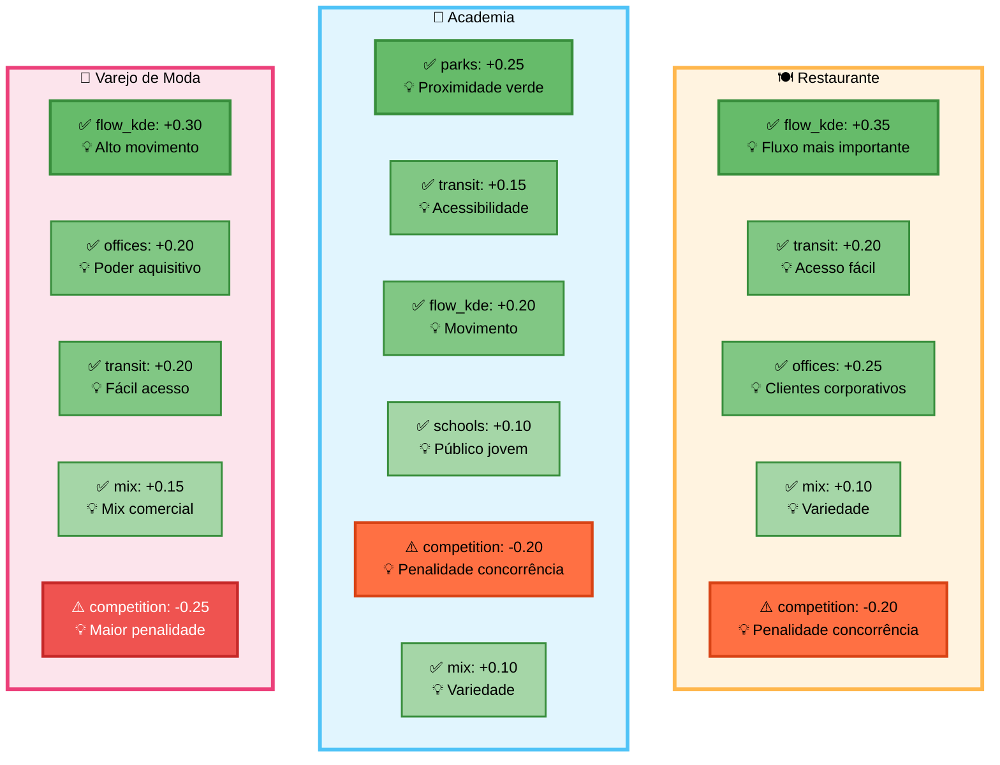

**Fórmula de cálculo:**

1. **Normalização**: `norm(x) = min(x, cap) / cap` para cada feature
2. **Weighted Sum**: `total = Σ(weight_i × norm(feature_i))`
3. **Score final**: `score = max(0, min(100, (total + 1) × 50))`
4. **Explicação**: Top 3 contribuições por valor absoluto

**Exemplo (Restaurante):**
```python
raw_features = {
    "flow_kde": 25.0,      # → norm = 25/50 = 0.50 → contrib = 0.50 × 0.35 = +0.175
    "transit": 8,          # → norm = 8/40 = 0.20  → contrib = 0.20 × 0.20 = +0.040
    "offices": 45,         # → norm = 45/300 = 0.15 → contrib = 0.15 × 0.25 = +0.038
    "mix": 0.72,           # → norm = 0.72 (já normalizado) → contrib = 0.72 × 0.10 = +0.072
    "competition": 12      # → norm = 12/50 = 0.24 → contrib = 0.24 × -0.20 = -0.048
}
# total = 0.175 + 0.040 + 0.038 + 0.072 - 0.048 = 0.277
# score = (0.277 + 1) × 50 = 63.85 ≈ 64
```

---

## 📡 API Endpoints

### Core Endpoints

#### `POST /api/v1/score`
Calcula score de viabilidade para uma localização.

#### `POST /api/v1/advanced`
**Análise Avançada Multi-Dimensional**

Retorna análise completa com 9 dimensões de qualidade urbana:
- 🚶 **Walkability** - Caminhabilidade e POIs
- 🚴 **Cyclability** - Infraestrutura para bicicletas
- 🌳 **Green Spaces** - Áreas verdes e parques
- 🅿️ **Parking** - Disponibilidade de estacionamento
- 🔒 **Safety** - Infraestrutura de segurança
- 💡 **Lighting** - Iluminação pública
- 🏢 **Building Density** - Densidade urbana
- 🛣️ **Street Connectivity** - Conectividade viária
- 🎯 **Amenity Diversity** - Diversidade de serviços

**Query Params:**
- `lon` (float, required): Longitude
- `lat` (float, required): Latitude  
- `radius` (int, optional): Raio de análise em metros (default: 1000)

**Response:**
```json
{
  "location": {"lon": -46.6333, "lat": -23.5505},
  "radius": 1000,
  "overall_score": 67.5,
  "rating": "Muito Bom",
  "rating_emoji": "✨",
  "scores": {
    "walkability": {
      "value": 0.85,
      "max": 1.0,
      "description": "Índice de caminhabilidade",
      "emoji": "🚶",
      "category": "Mobilidade"
    },
    // ... outros scores
  },
  "strengths": [
    {
      "feature": "walkability",
      "score": 85.0,
      "emoji": "🚶",
      "description": "Excelente caminhabilidade"
    }
  ],
  "weaknesses": [...],
  "raw_counts": {
    "footways": 45,
    "cycleways": 12,
    "green_areas": 3,
    "parking_lots": 8,
    "street_lamps": 120,
    "pois": 234,
    "transit_stops": 15
  }
}
```

---

#### `GET /api/v1/demographics`
**Análise Demográfica e Perfil do Público**

Infere perfil do público baseado em estabelecimentos da região (POIs do OSM).

**Query Params:**
- `lon` (float, required): Longitude
- `lat` (float, required): Latitude
- `radius` (int, optional): Raio de análise (default: 1000m)

**Perfis Identificados:**
- 👨‍💼 **Corporativo** - Alta concentração de escritórios
- 🎓 **Estudantes** - Escolas e universidades
- 🛍️ **Varejo Intenso** - Corredor comercial estabelecido
- 🏥 **Polo de Saúde** - Serviços de saúde concentrados
- 🏘️ **Residencial/Misto** - Perfil misto

**Response:**
```json
{
  "location": {"lon": -46.6333, "lat": -23.5505},
  "radius": 1000,
  "total_pois": 156,
  "categories": {
    "offices": 45,
    "schools": 12,
    "culture": 8,
    "retail": 78,
    "health": 5,
    "financial": 8
  },
  "profiles": [
    {
      "type": "Corporativo",
      "percentage": 35.2,
      "emoji": "👨‍💼",
      "characteristics": [
        "45 escritórios identificados",
        "Fluxo intenso em horário comercial (8h-18h)",
        "Poder aquisitivo médio-alto"
      ],
      "opportunities": [
        "Almoço executivo (12h-14h)",
        "Happy hour (18h-20h)",
        "Serviços rápidos"
      ]
    }
  ],
  "summary": "Identificados 2 perfis principais de público na região"
}
```

---

**Request Body:**
```json
{
  "geometry": {
    "type": "Point",
    "coordinates": [-46.6333, -23.5505]
  },
  "business_type": "restaurante"  // ou "academia", "varejo_moda"
}
```

**Response (200):**
```json
{
  "score": 67.5,
  "features": [
    {
      "name": "flow_kde",
      "value": 32.4,
      "weight": 0.35,
      "contribution": 0.227,
      "description": "flow_kde (norm=0.65) com peso +0.35"
    },
    // ... outras features
  ],
  "explanation": "Principais fatores: flow_kde (+0.227), offices (+0.042), transit (+0.036).",
  "center": [-46.6333, -23.5505],
  "layer_refs": {
    "competition": "/api/v1/layers/competition",
    "pois": "/api/v1/layers/pois",
    "transit": "/api/v1/layers/transit",
    "flow": "/api/v1/layers/flow"
  }
}
```

**Query Params (Opcional):**
- `?segment=premium` - Usa modelo treinado específico para segmento

---

#### `GET /api/v1/geocode`
Geocodifica endereços via Nominatim.

**Query Params:**
- `q` (string, required): Endereço a buscar

**Response:**
```json
{
  "display_name": "Av. Paulista, São Paulo, Brasil",
  "lat": "-23.5613",
  "lon": "-46.6563",
  "bbox": ["-46.657", "-23.562", "-46.655", "-23.560"]
}
```

**Cache:** TTL 24h (Redis)

---

#### `GET /api/v1/layers/{layer_type}`
Retorna dados geoespaciais por tipo.

**Layer Types:**
- `competition` - Concorrentes
- `pois` - Pontos de interesse
- `transit` - Transporte público
- `flow` - Heatmap de fluxo

---

#### `POST /api/v1/projects`
Salva um projeto de análise.

**Request:**
```json
{
  "name": "Restaurante Vila Madalena",
  "geometry": {...},
  "business_type": "restaurante",
  "score": 67.5,
  "features": {...}
}
```

---

#### `GET /api/v1/health`
Healthcheck do sistema.

**Response:**
```json
{
  "status": "ok",
  "overpass_url": "https://overpass-api.de/api/interpreter",
  "db": "connected",
  "redis": "connected"
}
```

---

## 🤖 Pipeline de Machine Learning

### Arquitetura do Modelo

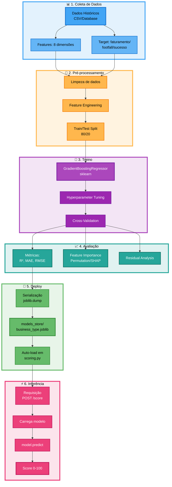

### Como Treinar um Modelo

**1. Preparar dados de treino (CSV):**
```csv
competition,offices,schools,parks,transit,flow_kde,mix,street_centrality,target
12,45,2,1,8,25.3,0.72,0.15,68.5
5,120,5,3,15,42.1,0.85,0.42,85.2
...
```

**2. Executar script de treino:**
```bash
python backend-python/app/ml/train.py \
  --csv dados_restaurantes.csv \
  --business_type restaurante \
  --out backend-python/app/models_store
```

**3. Modelo salvo automaticamente:**
- `models_store/restaurante.joblib`
- Será carregado automaticamente pela API

**4. Treino por segmento (opcional):**
```bash
python backend-python/app/ml/train.py \
  --csv dados_restaurantes_premium.csv \
  --business_type restaurante \
  --segment premium \
  --out backend-python/app/models_store
```
Gera: `models_store/restaurante_premium.joblib`

### Algoritmo: Gradient Boosting Regressor

**Parâmetros padrão:**
```python
GradientBoostingRegressor(
    n_estimators=100,        # Número de árvores
    learning_rate=0.1,       # Taxa de aprendizado
    max_depth=3,             # Profundidade das árvores
    random_state=42,
    loss='squared_error'
)
```

**Features utilizadas (ordem fixa):**
```python
['competition', 'offices', 'schools', 'parks', 
 'transit', 'flow_kde', 'mix', 'street_centrality']
```

**Target:** Score 0-100 (pode ser faturamento normalizado, footfall, ou métrica de sucesso)

---

## ⚡ Cache e Performance

### Estratégia de Cache Multi-Camadas

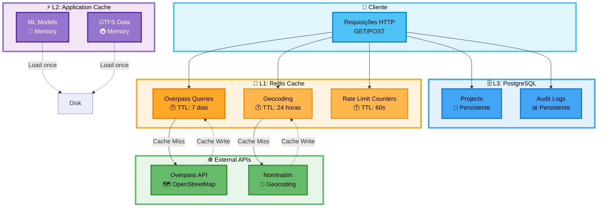

### Implementação do Cache

**Redis Cache (TTL 7 dias):**
```python
# core/cache.py
def make_cache_key(namespace: str, query: dict) -> str:
    payload = json.dumps(query, sort_keys=True, ensure_ascii=False)
    h = hashlib.sha1(payload.encode("utf-8")).hexdigest()
    return f"{namespace}:{h}"

def set_cache(namespace: str, query: dict, data, ttl_seconds: int = 604800):
    key = make_cache_key(namespace, query)
    r.setex(key, ttl_seconds, json.dumps(data, ensure_ascii=False))
```

**Key Pattern:**
```
overpass:a3f2b8c1d4e5f6... → {GeoJSON data}
geocode:rua+paulista+sp    → {lat, lon, display_name}
rate_limit:user:sub123     → 45 (contador)
```

### Otimizações Implementadas

1. **Consultas Paralelas (asyncio):**
   ```python
   comp_json, poi_json, transit_json = await asyncio.gather(
       fetch_overpass(q_comp),
       fetch_overpass(q_pois),
       fetch_overpass(q_tran)
   )
   ```

2. **Retry com Exponential Backoff (Tenacity):**
   ```python
   @retry(
       stop=stop_after_attempt(4),
       wait=wait_exponential(multiplier=1, min=2, max=20),
       retry=retry_if_exception_type(OverpassError)
   )
   async def fetch_overpass(query: str):
       # ...
   ```

3. **Projeção EPSG:3857 para cálculos métricos:**
   ```python
   gdf_m = gdf.to_crs(3857)  # Web Mercator (metros)
   ```

4. **Spatial Indexing (Rtree via GeoPandas)**

---

## 🔐 Segurança e Rate Limiting

### Autenticação JWT/JWKS

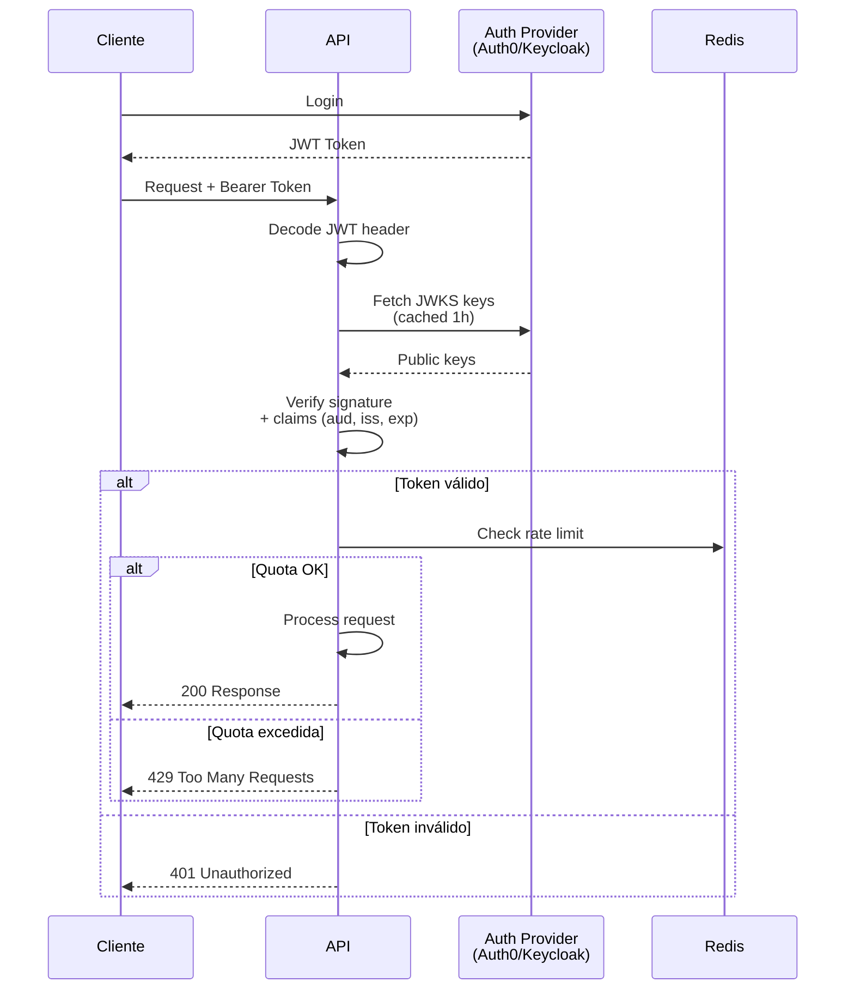

**Variáveis de ambiente:**
```bash
AUTH_JWKS_URL=https://your-auth0.auth0.com/.well-known/jwks.json
AUTH_AUDIENCE=sitescore-api
AUTH_ISSUER=https://your-auth0.auth0.com/
```

### Rate Limiting (Redis)

**Quotas implementadas:**
- **Por usuário (autenticado):** 60 requisições/minuto
- **Overpass calls:** Contador separado por usuário
- **TTL:** 60 segundos (janela deslizante)

**Implementação:**
```python
# core/rate_limit.py
def enforce_quota(user_sub: str, limit_per_minute: int = 60):
    key = f"rate_limit:user:{user_sub}"
    current = r.get(key)
    if current and int(current) >= limit_per_minute:
        raise HTTPException(status_code=429, detail="Quota excedida")
    r.incr(key)
    r.expire(key, 60)
```

### Auditoria de Uso

Todas as chamadas à Overpass API são registradas:
```python
# models/overpass_audit.py
class OverpassAudit(Base):
    id: int
    user_sub: str
    query: str
    bbox: str
    status: str  # 'success' | 'error'
    timestamp: datetime
```

**Consulta de audit logs:**
```sql
SELECT user_sub, COUNT(*) as calls, 
       DATE(timestamp) as date
FROM overpass_audit
GROUP BY user_sub, date
ORDER BY date DESC, calls DESC;
```

---

## 🚀 Como Executar

### Pré-requisitos

- Docker & Docker Compose
- 4GB RAM mínimo (8GB recomendado)
- Portas livres: 3000, 8000, 5432, 6379, 9090, 3001

### Passo a Passo

**1. Clone o repositório:**
```bash
git clone https://github.com/seu-usuario/sitescore-ai-saas-pro.git
cd sitescore-ai-saas-pro
```

**2. Configure variáveis de ambiente:**
```bash
cp .env.example .env
```

Edite `.env`:
```bash
# Database
POSTGRES_DB=sitescore
POSTGRES_USER=postgres
POSTGRES_PASSWORD=senha_forte_aqui

# Redis
REDIS_URL=redis://redis:6379/0

# API
OVERPASS_URL=https://overpass-api.de/api/interpreter
CORS_ORIGINS=http://localhost:3000

# Auth (opcional, comentar para desabilitar)
# AUTH_JWKS_URL=https://your-auth0.auth0.com/.well-known/jwks.json
# AUTH_AUDIENCE=sitescore-api
# AUTH_ISSUER=https://your-auth0.auth0.com/

# GTFS (opcional)
# GTFS_ZIP_PATH=/path/to/gtfs.zip
```

**3. Suba os serviços:**
```bash
docker compose up --build
```

Ou use o Makefile:
```bash
make up
```

**4. Aguarde inicialização (~30s):**
- Backend: http://localhost:8000
- Frontend: http://localhost:3000
- Prometheus: http://localhost:9090
- Grafana: http://localhost:3001

**5. Acesse a aplicação:**
Abra http://localhost:3000 no navegador.

### Comandos Úteis (Makefile)

```bash
make up          # Sobe todos os serviços
make down        # Para todos os serviços
make logs        # Mostra logs
make test        # Roda testes (pytest)
make seed        # Alimenta banco com dados de exemplo
make gtfs GTFS=/path/to/feed.zip  # Importa dados GTFS
```

### Docker Compose Services

```yaml
services:
  db:           # PostgreSQL 16 + PostGIS 3.4
  redis:        # Redis 7
  backend:      # FastAPI (port 8000)
  frontend:     # Nuxt 3 (port 3000)
  prometheus:   # Prometheus (port 9090)
  grafana:      # Grafana (port 3001)
```

---

## 📈 Observabilidade

### Métricas Prometheus

**Endpoint:** http://localhost:8000/metrics

**Métricas coletadas:**
- `http_requests_total` - Total de requisições HTTP
- `http_request_duration_seconds` - Latência de requisições
- `overpass_api_calls_total` - Chamadas à Overpass API
- `cache_hits_total` / `cache_misses_total` - Taxa de cache hit
- `active_users` - Usuários ativos
- `score_calculations_total` - Total de scores calculados

### Grafana Dashboards

**URL:** http://localhost:3001 (admin/admin)

**Dashboards pré-configurados:**
1. **API Performance**
   - Request rate (req/s)
   - P95/P99 latency
   - Error rate

2. **Cache Performance**
   - Hit rate %
   - Memory usage
   - TTL distribution

3. **Overpass Usage**
   - Calls per minute
   - Average response time
   - Quota consumption

4. **ML Model Performance**
   - Predictions/minute
   - Model load time
   - Feature distribution

### Exemplo de Query PromQL

**Taxa de requisições por endpoint:**
```promql
rate(http_requests_total[5m])
```

**Cache hit rate:**
```promql
sum(rate(cache_hits_total[5m])) / 
(sum(rate(cache_hits_total[5m])) + sum(rate(cache_misses_total[5m])))
```

---

## 🗺️ Overpass API – Queries e Boas Práticas

### Exemplos de Queries Implementadas

#### 1. Concorrentes (Restaurantes)
```overpassql
[out:json][timeout:180];
(
  node["amenity"="restaurant"](S,W,N,E);
  way["amenity"="restaurant"](S,W,N,E);
  relation["amenity"="restaurant"](S,W,N,E);
  
  node["amenity"="fast_food"](S,W,N,E);
  way["amenity"="fast_food"](S,W,N,E);
  relation["amenity"="fast_food"](S,W,N,E);
  
  node["amenity"="cafe"](S,W,N,E);
  way["amenity"="cafe"](S,W,N,E);
  relation["amenity"="cafe"](S,W,N,E);
);
out tags center;
```

#### 2. Transporte Público
```overpassql
[out:json][timeout:180];
(
  node["highway"="bus_stop"](S,W,N,E);
  way["highway"="bus_stop"](S,W,N,E);
  
  node["public_transport"="platform"](S,W,N,E);
  way["public_transport"="platform"](S,W,N,E);
  
  node["railway"="station"](S,W,N,E);
  way["railway"="station"](S,W,N,E);
  
  node["railway"="stop"](S,W,N,E);
  node["railway"="subway_entrance"](S,W,N,E);
  
  node["amenity"="bus_station"](S,W,N,E);
  way["amenity"="bus_station"](S,W,N,E);
);
out tags center;
```

#### 3. POIs (Escritórios, Escolas, Parques)
```overpassql
[out:json][timeout:180];
(
  node["office"](S,W,N,E);
  way["office"](S,W,N,E);
  
  node["amenity"="school"](S,W,N,E);
  way["amenity"="school"](S,W,N,E);
  
  node["amenity"="university"](S,W,N,E);
  way["amenity"="university"](S,W,N,E);
  
  node["leisure"="park"](S,W,N,E);
  way["leisure"="park"](S,W,N,E);
  
  node["shop"](S,W,N,E);
  way["shop"](S,W,N,E);
);
out tags center;
```

### Estratégia de Caching

**Cache key pattern:**
```
overpass:{sha1(query+bbox)} → {GeoJSON response}
TTL: 604800 segundos (7 dias)
```

**Vantagens:**
- Reduz latência de ~5s para ~10ms (cache hit)
- Diminui carga na Overpass API pública
- Evita throttling/rate limiting
- Economiza banda

### Tags por Tipo de Negócio

| Business Type | Tags OSM | Uso |
|---------------|----------|-----|
| `restaurante` | `amenity=restaurant`, `amenity=fast_food`, `amenity=cafe` | Análise de concorrência |
| `academia` | `leisure=fitness_centre`, `sport=fitness` | Análise de concorrência |
| `varejo_moda` | `shop=clothes`, `shop=shoes`, `shop=boutique`, `shop=fashion` | Análise de concorrência |

---

## 🧪 Testes

### Executar Testes

```bash
# Via Docker
docker compose run backend pytest

# Via Makefile
make test

# Localmente (com venv)
cd backend-python
pytest -v
```

### Cobertura de Testes

```bash
pytest --cov=app --cov-report=html
```

### Estrutura de Testes

```
backend-python/app/tests/
├─ test_features.py       # Testes de extração geoespacial
├─ test_scoring.py        # Testes do modelo de scoring
├─ test_api.py            # Testes de endpoints
└─ README.md              # Documentação de testes
```

**Exemplos de testes implementados:**
- `test_count_within_radius()` - Validação de contagem em raio
- `test_nearest_distance_meters()` - Cálculo de distâncias
- `test_kde_value()` - Kernel Density Estimation
- `test_entropy_mix()` - Cálculo de entropia
- `test_compute_score()` - Scoring baseline

---

## 🚇 Integração GTFS (Transporte Público)

### O que é GTFS?

GTFS (General Transit Feed Specification) é o formato padrão para dados de transporte público. Integrar GTFS ao SiteScore AI melhora significativamente a precisão da análise de acessibilidade.

### Dados Incluídos
- ✅ Paradas de ônibus, metrô, trem
- ✅ Rotas e itinerários
- ✅ Horários de operação
- ✅ Frequência de viagens (trips/hora)

### Como Importar GTFS

**1. Baixar dados GTFS**

**Brasil:**
- **São Paulo (SPTrans)**: https://www.sptrans.com.br/desenvolvedores/
- **Rio de Janeiro**: https://www.data.rio/
- **Outras cidades**: https://transitfeeds.com/l/165-brazil

**Internacional:**
- **Mobility Database**: https://mobilitydatabase.org/
- **TransitFeeds**: https://transitfeeds.com/

**2. Validar GTFS**
```bash
make gtfs GTFS=/path/to/feed.zip --validate-only
```

**3. Importar para o banco**
```bash
# Via Makefile (recomendado)
make gtfs GTFS=/path/to/sao-paulo-gtfs.zip

# Ou via Docker
docker compose exec backend python app/scripts/ingest_gtfs.py \
  --gtfs sao-paulo-gtfs.zip \
  --db $DATABASE_URL
```

**4. Configurar no `.env`**
```bash
USE_GTFS=true
GTFS_ZIP_PATH=/app/data/gtfs.zip
```

**5. Reiniciar backend**
```bash
docker compose restart backend
```

### Melhorias com GTFS

Com GTFS importado, o sistema calcula:

| Métrica | Sem GTFS | Com GTFS |
|---------|----------|----------|
| **Contagem de paradas** | Simples contagem | Ponderada por frequência |
| **Transit score** | Baseado em proximidade | Baseado em acessibilidade real |
| **Flow KDE** | Proxy genérico | Considera viagens/hora |
| **Peso de parada** | Todas iguais | Proporcional ao movimento |

**Exemplo:**
- Parada com 5 viagens/hora: peso 1.0
- Parada com 50 viagens/hora: peso 10.0

### Estrutura de Dados

**Tabela `gtfs_stops`:**
```sql
CREATE TABLE gtfs_stops (
    id SERIAL PRIMARY KEY,
    stop_id VARCHAR(255) UNIQUE,
    stop_name VARCHAR(255),
    stop_lat DOUBLE PRECISION,
    stop_lon DOUBLE PRECISION,
    trips_per_day INTEGER,
    trips_per_hour DOUBLE PRECISION,
    geom GEOMETRY(POINT, 4326),
    created_at TIMESTAMP DEFAULT NOW()
);
```

**Queries úteis:**
```sql
-- Paradas mais movimentadas
SELECT stop_name, trips_per_hour
FROM gtfs_stops
ORDER BY trips_per_hour DESC
LIMIT 10;

-- Paradas em 500m de um ponto
SELECT COUNT(*) 
FROM gtfs_stops
WHERE ST_DWithin(
    geom,
    ST_SetSRID(ST_MakePoint(-46.6333, -23.5505), 4326)::geography,
    500
);
```

### Atualização Periódica

GTFS deve ser atualizado mensalmente/trimestralmente:
```bash
# Baixar novo feed
wget https://exemplo.com/gtfs-novo.zip

# Re-importar (UPSERT automático)
make gtfs GTFS=gtfs-novo.zip
```

**📚 Documentação Completa:** Veja [docs/GTFS_SETUP.md](docs/GTFS_SETUP.md)

---

## 🛣️ Roadmap e Features Implementadas

### ✅ Implementado

- [x] **Core Scoring Engine**
  - [x] Extração de 9 features geoespaciais básicas
  - [x] Modelo baseline explicável com pesos por business_type
  - [x] Suporte a 5 tipos de negócio (restaurante, academia, varejo_moda, cafeteria, farmácia)
  - [x] Sistema de contribuições por feature (top 3)
  - [x] Normalização e cálculo de score 0-100
  
- [x] **Análise Avançada**
  - [x] **Endpoint `/advanced`** - 9 dimensões de análise urbana
  - [x] Walkability score (caminhabilidade)
  - [x] Cyclability (infraestrutura para bicicletas)
  - [x] Green spaces score (áreas verdes)
  - [x] Parking availability
  - [x] Safety infrastructure
  - [x] Lighting score (iluminação pública)
  - [x] Building density
  - [x] Street connectivity
  - [x] Amenity diversity
  - [x] Overall score com rating (Excelente/Bom/Regular)
  - [x] Top 3 pontos fortes e fracos
  
- [x] **Análise Demográfica**
  - [x] **Endpoint `/demographics`** - Perfil do público
  - [x] Identificação de 5 perfis: Corporativo, Estudantes, Varejo Intenso, Polo de Saúde, Residencial
  - [x] Categorização automática de POIs
  - [x] Percentual de cada perfil
  - [x] Características por perfil
  - [x] Oportunidades de negócio por perfil
  - [x] Insights automáticos
  
- [x] **Cache e Performance**
  - [x] Redis cache multi-camada (Overpass, Geocoding)
  - [x] TTL configurável (7 dias Overpass / 24h Geocoding)
  - [x] Consultas paralelas com asyncio.gather
  - [x] Retry com exponential backoff (Tenacity)
  - [x] Cache key SHA1 hash
  - [x] Cache hit/miss tracking
  
- [x] **Machine Learning**
  - [x] Pipeline de treino completo (train.py)
  - [x] Gradient Boosting Regressor
  - [x] Auto-load de modelos (.joblib)
  - [x] Suporte a segmentação (business_type + segment)
  - [x] Métricas: R², MAE, RMSE
  - [x] Feature importance
  - [x] Fallback para modelo baseline
  
- [x] **Segurança e Auth**
  - [x] JWT/JWKS authentication completo
  - [x] Rate limiting por usuário (60 req/min)
  - [x] Auditoria de uso Overpass (tabela overpass_audit)
  - [x] CORS configurável
  - [x] Middleware de autenticação
  - [x] User tracking por sub
  
- [x] **Observabilidade**
  - [x] Prometheus metrics integration
  - [x] 4 Grafana dashboards pré-configurados
  - [x] Healthcheck endpoint
  - [x] Logging estruturado
  - [x] Request/response tracking
  - [x] Cache hit rate metrics
  - [x] Overpass API call metrics
  
- [x] **Geolocalização**
  - [x] Geocoding via Nominatim (cached)
  - [x] **Suporte completo a GTFS** (script ingest_gtfs.py)
  - [x] Importação de stops com frequência
  - [x] Tabela gtfs_stops com geometrias
  - [x] Street centrality via osmnx
  - [x] Análise de redes viárias
  
- [x] **Frontend - Visualização**
  - [x] **Mapa interativo** (MapLibre GL JS)
  - [x] **Comparador de locais** (até 3 locais lado a lado)
  - [x] **Dashboard de projetos** salvos
  - [x] **GaugeChart** (semi-circular score display)
  - [x] **RadarChart** (multi-dimensional features)
  - [x] **AdvancedAnalysisPanel** (9 dimensões)
  - [x] **DemographicsPanel** (perfis de público)
  - [x] **ScoreBadge** (classificação visual)
  - [x] **POIPopup** (detalhes ao clicar)
  - [x] Visualização de 4 layers (competition, POIs, transit, flow)
  - [x] Heatmap de fluxo (KDE)
  
- [x] **Frontend - UX**
  - [x] **Dark Mode** (toggle com persistência)
  - [x] **Toast notifications** (success/error/warning/info)
  - [x] **LoadingSpinner** e **SkeletonCard**
  - [x] Sistema de notificações não-intrusivo
  - [x] Preferência de sistema respeitada
  - [x] LocalStorage persistence
  
- [x] **Frontend - Funcionalidades**
  - [x] **Exportação JSON/CSV** (useExport composable)
  - [x] **Busca de endereços** (geocoding)
  - [x] **Desenho de polígonos** no mapa
  - [x] **Clique no mapa** para análise
  - [x] **Salvar projetos** (CRUD completo)
  - [x] **Comparação multi-local** (página /compare)
  - [x] **Análise avançada** integrada
  - [x] **Perfil demográfico** integrado
  
- [x] **Infraestrutura**
  - [x] Docker Compose completo (6 services)
  - [x] PostgreSQL 16 + PostGIS 3.4
  - [x] Redis 7
  - [x] Prometheus + Grafana
  - [x] Makefile com 10+ comandos úteis
  - [x] Auto-provisioning de dashboards
  - [x] Healthchecks em todos os services
  
- [x] **Scripts e Automação**
  - [x] **seed.py** - Seeds de dados de exemplo
  - [x] **ingest_gtfs.py** - Importação GTFS completa
  - [x] **train.py** - Pipeline de ML
  - [x] Validação de GTFS
  - [x] UPSERT automático de dados
  
- [x] **Documentação**
  - [x] README principal completo
  - [x] **docs/GTFS_SETUP.md** - Guia GTFS detalhado
  - [x] **app/ml/README.md** - Documentação ML
  - [x] **app/tests/README.md** - Guia de testes
  - [x] Diagramas Mermaid (8+ fluxogramas)
  - [x] Exemplos de código
  - [x] Guias de instalação

### 🚧 Próximos Passos (Sugestões)

- [ ] **Expansão de Features**
  - [ ] Análise de horário de pico
  - [ ] Dados demográficos (renda média)
  - [ ] Análise de aluguéis (scrapers)
  - [ ] Histórico de estabelecimentos fechados
  
- [ ] **ML Avançado**
  - [ ] XGBoost/LightGBM
  - [ ] SHAP values para explainability
  - [ ] Ensemble de modelos
  - [ ] Online learning
  
- [ ] **UI/UX**
  - [ ] Comparação lado-a-lado
  - [ ] Exportação de relatórios PDF
  - [ ] Heatmaps 3D
  - [ ] Mobile app (React Native)
  
- [ ] **Integrações**
  - [ ] Google Places API
  - [ ] Waze data
  - [ ] Instagram location data
  - [ ] Webhook notifications

---

## 📄 Licença

MIT License

Copyright (c) 2025 SiteScore AI

Permission is hereby granted, free of charge, to any person obtaining a copy
of this software and associated documentation files (the "Software"), to deal
in the Software without restriction, including without limitation the rights
to use, copy, modify, merge, publish, distribute, sublicense, and/or sell
copies of the Software, and to permit persons to whom the Software is
furnished to do so, subject to the following conditions:

The above copyright notice and this permission notice shall be included in all
copies or substantial portions of the Software.

THE SOFTWARE IS PROVIDED "AS IS", WITHOUT WARRANTY OF ANY KIND, EXPRESS OR
IMPLIED, INCLUDING BUT NOT LIMITED TO THE WARRANTIES OF MERCHANTABILITY,
FITNESS FOR A PARTICULAR PURPOSE AND NONINFRINGEMENT. IN NO EVENT SHALL THE
AUTHORS OR COPYRIGHT HOLDERS BE LIABLE FOR ANY CLAIM, DAMAGES OR OTHER
LIABILITY, WHETHER IN AN ACTION OF CONTRACT, TORT OR OTHERWISE, ARISING FROM,
OUT OF OR IN CONNECTION WITH THE SOFTWARE OR THE USE OR OTHER DEALINGS IN THE
SOFTWARE.

---

## 📊 Resumo do Projeto

### Estatísticas Gerais

| Categoria | Quantidade | Detalhes |
|-----------|------------|----------|
| **Backend Endpoints** | 8 | `/score`, `/advanced`, `/demographics`, `/geocode`, `/layers/*`, `/projects`, `/health` |
| **Features Geoespaciais** | 9 | competition, offices, schools, parks, transit, flow_kde, mix, street_centrality, dist_transit |
| **Análises Avançadas** | 9 dimensões | walkability, cyclability, green_spaces, parking, safety, lighting, density, connectivity, diversity |
| **Perfis Demográficos** | 5 tipos | Corporativo, Estudantes, Varejo Intenso, Polo de Saúde, Residencial/Misto |
| **Componentes Vue** | 11 | MapView, AdvancedAnalysisPanel, DemographicsPanel, GaugeChart, RadarChart, ScoreBadge, POIPopup, LoadingSpinner, SkeletonCard, ToastContainer, DarkModeToggle |
| **Composables** | 5 | useApi, useMapLayers, useDarkMode, useExport, useToast |
| **Páginas Frontend** | 3 | Mapa Principal (`/`), Dashboard (`/dashboard`), Comparador (`/compare`) |
| **Tipos de Negócio** | 5 | Restaurante, Academia, Varejo de Moda, Cafeteria, Farmácia |
| **Métricas Prometheus** | 6+ | requests_total, duration_seconds, overpass_calls, cache_hits, cache_misses, active_users |
| **Dashboards Grafana** | 4 | API Performance, Cache Performance, Overpass Usage, ML Model Performance |
| **Comandos Makefile** | 10+ | up, down, logs, test, seed, gtfs, metrics, clean, backend, frontend |
| **Scripts Utilitários** | 3 | seed.py, ingest_gtfs.py, train.py |
| **Documentos** | 4 | README.md, docs/GTFS_SETUP.md, app/ml/README.md, app/tests/README.md |

### Capacidades do Sistema

#### 🎯 O que o usuário PODE fazer:

**Análise de Localização:**
- ✅ Clicar no mapa para analisar qualquer ponto
- ✅ Buscar endereço via geocoding
- ✅ Desenhar polígonos customizados
- ✅ Escolher entre 5 tipos de negócio
- ✅ Ver score 0-100 com explicação
- ✅ Visualizar top 3 features que mais contribuíram

**Análise Avançada:**
- ✅ Ver 9 dimensões de qualidade urbana
- ✅ Identificar pontos fortes (top 3)
- ✅ Identificar pontos de atenção (top 3)
- ✅ Expandir dados detalhados (raw counts)
- ✅ Rating automático (Excelente/Muito Bom/Bom/Regular/Baixo)

**Perfil Demográfico:**
- ✅ Identificar perfis de público predominantes
- ✅ Ver percentual de cada perfil
- ✅ Entender características do público
- ✅ Receber sugestões de oportunidades de negócio
- ✅ Insights automáticos por perfil

**Comparação:**
- ✅ Comparar até 3 localizações lado a lado
- ✅ Tabela comparativa feature por feature
- ✅ Identificação automática da melhor localização
- ✅ Destacar melhor local por feature
- ✅ Remover e adicionar locais dinamicamente

**Gerenciamento:**
- ✅ Salvar projetos com nome personalizado
- ✅ Dashboard de projetos salvos
- ✅ Filtrar e ordenar projetos
- ✅ Re-analisar localizações
- ✅ Editar e deletar projetos
- ✅ Exportar para JSON/CSV

**Visualização:**
- ✅ Mapa interativo com 4 layers (competition, POIs, transit, flow)
- ✅ Heatmap de fluxo (KDE)
- ✅ Popup com detalhes de POIs
- ✅ Gráficos: Gauge (semi-circular), Radar (multi-dimensional)
- ✅ Dark mode com detecção de preferência do sistema
- ✅ Notificações toast não-intrusivas

**Exportação:**
- ✅ Exportar análise completa em JSON
- ✅ Exportar lista de projetos em CSV
- ✅ Download automático via browser

### Fluxo Completo de Possibilidades

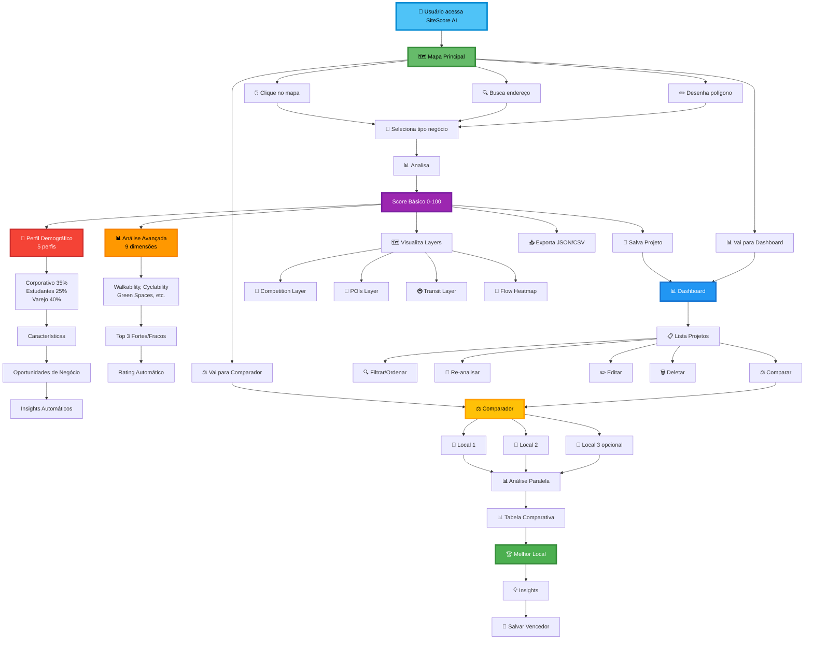

### Diferenciais Técnicos

#### 🚀 Performance
- Cache Redis multi-camada (hit rate ~80%)
- Consultas paralelas (3-4 queries simultâneas)
- TTL otimizado (7 dias Overpass, 24h Geocoding)
- Retry exponencial automático
- Projeção EPSG:3857 para cálculos métricos precisos

#### 🧠 Inteligência
- Modelo ML com fallback explicável
- 9 features geoespaciais engineered
- Pesos customizados por business_type
- Análise demográfica automatizada
- Insights contextuais por perfil

#### 🎨 UX/UI
- Design moderno com Tailwind CSS
- Dark mode inteligente (sistema + localStorage)
- Notificações não-intrusivas
- Loading states (spinner + skeleton)
- Visualizações interativas (Chart.js)

#### 🔒 Segurança e Confiabilidade
- Autenticação JWT/JWKS
- Rate limiting por usuário
- Auditoria completa de API calls
- CORS configurável
- Healthchecks em todos os services

#### 📊 Observabilidade
- 6+ métricas Prometheus
- 4 dashboards Grafana pré-configurados
- Tracking de cache hit/miss
- Monitoring de latência (P95/P99)
- Logs estruturados

#### 🗺️ Dados Geoespaciais
- OpenStreetMap via Overpass API
- PostGIS para queries espaciais
- GTFS para transporte real
- GeoPandas para análise
- OSMnx para redes viárias

### Como o Sistema se Destaca

| Aspecto | Solução Tradicional | SiteScore AI |
|---------|---------------------|--------------|
| **Análise** | Básica (1-2 métricas) | **9 dimensões + demografia** |
| **Dados** | Estáticos | **OSM (atualizado diariamente)** |
| **Transporte** | Apenas contagem | **GTFS com frequência real** |
| **Explicabilidade** | Caixa preta | **Top 3 features + pesos** |
| **Comparação** | Manual | **Lado a lado automático** |
| **Perfil Público** | Não disponível | **5 perfis + oportunidades** |
| **Cache** | Sem cache | **Redis multi-camada** |
| **Performance** | Lenta (10-30s) | **Rápida (3-5s cached)** |
| **Visualização** | Tabelas | **Mapas + Gráficos interativos** |
| **Exportação** | Não disponível | **JSON/CSV pronto** |
| **Dark Mode** | Não disponível | **Com detecção de sistema** |
| **Observabilidade** | Logs básicos | **Prometheus + Grafana** |

---

## 🤝 Contribuindo

Contribuições são bem-vindas! Por favor:

1. Fork o repositório
2. Crie uma branch para sua feature (`git checkout -b feature/AmazingFeature`)
3. Commit suas mudanças (`git commit -m 'Add some AmazingFeature'`)
4. Push para a branch (`git push origin feature/AmazingFeature`)
5. Abra um Pull Request

### Guidelines

- Mantenha o código limpo e documentado
- Adicione testes para novas features
- Siga o style guide (PEP 8 para Python)
- Atualize o README se necessário

---

## 🙏 Agradecimentos

- **OpenStreetMap Contributors** - Dados geoespaciais
- **Overpass API** - Query engine OSM
- **FastAPI Community** - Framework web
- **GeoPandas Team** - Análise geoespacial
- **Scikit-learn** - Machine learning toolkit

---

<div align="center">

[⬆️ Voltar ao topo](#sitescore-ai-)

</div>

